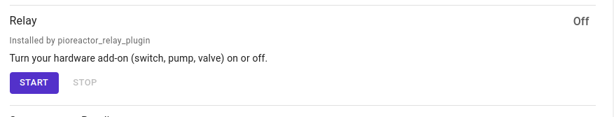

Describes how to get started with CO2 sparging on the Pioreactor.

## Kit List

### Pioreactor
1. [Pioreactor 20 mL](https://pioreactor.com/products/pioreactor-20ml?variant=46559156469816) (or via [LabCrafter](https://labcrafter.co.uk/products/pioreactor) if you're in the UK/EU)
1. [Raspberry Pi Zero 2 W with header](https://www.raspberrypi.com/products/raspberry-pi-zero-2-w/)
1. [Raspberry Pi Micro USB Power Supply](https://www.raspberrypi.com/products/micro-usb-power-supply/) (or via [LabCrafter](https://labcrafter.co.uk/products/raspberry-pi-micro-usb-power-supply) if you're in the UK/EU)
1. [Micro SD card](https://docs.pioreactor.com/user-guide/common-questions#what-microsd-cards-do-you-recommend) (or via [LabCrafter](https://labcrafter.co.uk/products/raspberry-pi-sd-card-32gb) if you're in the UK/EU)

### CO2 sparging kit
1. Sodastream cylinder (classic blue, not quick connect pink)
1. [Sodastream-to-regulator adapter](https://www.aliexpress.com/item/4001089851288.html) (TR21-4 thread size in most of the world, CGA 320 in North America)
1. CO2 regulator with solenoid, e.g. [FZONE](https://fzaqua.com/collections/co2-system/products/fzone-dual-big-gauge-co2-regulator-1)
1. [Barrel power cord with 2.1mm DC plug](https://uk.farnell.com/pro-elec/pelb2059/lead-2-1mm-dc-plug-to-bare-end/dp/4160342)
1. Connector to connect barrel power cord to PWM output, e.g. TE Connectivity AMP connector ([housing](https://www.digikey.co.uk/en/products/detail/te-connectivity-amp-connectors/487526-1/469847) and [socket contacts](https://www.digikey.co.uk/en/products/detail/te-connectivity-amp-connectors/1-104479-0/1125892)), or solder Dupont female square head wires to barrel power cord
1. [~20cm 4mm PU tubing](https://www.ebay.co.uk/itm/291069297042?var=590231498499)
1. [Check valve](https://www.ebay.co.uk/itm/332346151810?var=541346989524)
1. [3/16" barb female Luer lock connector](https://www.aliexpress.com/item/1005008018941210.html)
1. [2 x 1/16" barb male Luer lock connectors](https://pioreactor.com/collections/accessories-and-parts/products/luer-lock-and-barb-connectors-for-1-16th-tubing?variant=43567879127096)
1. [~10cm 1/16" silicone tubing](https://www.ebay.co.uk/itm/271187701636?var=570151692909)

### 3D printable parts
1. [Pioreactor vial cap for electrolysis and CO2 sparging](https://www.printables.com/model/974845-pioreactor-vial-cap-with-hole-for-6mm-electrode)
1. [Dovetail platform for Pioreactor](https://www.printables.com/model/298240-pioreactor-platform-with-dovetails-for-a-zero-mode)
1. [Dovetail platform for Sodastream cylinder holder](https://www.printables.com/model/855700-sodastream-holder-for-pioreactor)

### Tools required
1. Crimping pliers, if you're going to use the TE Connectivity AMP connectors with the barrel power cord, or a soldering iron if you're going to solder Dupont cables to the barrel power cord
1. Wrench for attaching adapter to Sodastream cylinder and regulator


## Setup

### Hardware
1. Connect the CO2 regulator to the Sodastream cylinder using the adapter and a wrench.
    
    
1. Connect one end of ~20cm PU tubing <span style="color: red;">to the regulator</span> and the other end <span style="color: green;">to a check valve</span>.

1. Connect another short piece of PU tubing to <span style="color: red;">the other end of the check valve</span> and <span style="color: green;">attach a 3/16" barb female Luer lock connector</span>. Attach two 1/16" barb male Luer lock connectors to each end of ~10cm of 1/16" silicone tubing and connect to <span style="color: green;">the 3/16" connector</span> and <span style="color: blue;">the Pioreactor port</span>.

1. Connect the barrel power cord to <span style="color: red;">PWM channel 4</span> on the one end. You can either solder Dupont female square head wires to the power cord, or crimp a TE Connectivity AMP connector as in the image.

1. Plug the other end of the power cord into the <span style="color: red;">solenoid of the regulator</span>.

1. Make sure that your Pioreactor [supports 12V on the PWM channels](https://docs.pioreactor.com/user-guide/external-power) and that a 12V power supply is connected to the barrel jack of the Pioreactor HAT.

### Software
1. [Install](https://docs.pioreactor.com/user-guide/using-community-plugins#installing-plugins) the `pioreactor-relay-plugin` plugin.
2. In your Pioreactor configuration, make sure that PWM channel 4 is set to `relay`:
```
[PWM]
# map the PWM channels to externals.
# hardware PWM are available on channels 2 & 4.
1=stirring
2=media
3=waste
4=relay
5=heating
```
3. Test that it works by manually turning on the relay in the **Activities** tab of the *Manage* screen of the Pioreactor UI. You should hear the solenoid turn on and CO2 rushing into the Pioreactor vial. You can adjust the amount of CO2 sparged using the dial on the regulator.
    
    
4. Create a new [experiment profile](https://docs.pioreactor.com/user-guide/experiment-profiles) and copy and paste the following into the profile:
```yaml
experiment_profile_name: CO2 sparging every hour

metadata:
  author: Gerrit Niezen
  description: Turns on the relay for 10 seconds every hour

common:
  jobs:
    relay:
      actions:
        - type: repeat
          hours_elapsed: 1.0
          repeat_every_hours: 1.0
          actions:
            - type: log
              hours_elapsed: 0.0  # relative to the repeat loop, 1h
              options:
                message: "Sparging CO2 for 10 seconds"
                level: info
            - type: start
              hours_elapsed: 0.0
              options:
                start_on: True
            - type: stop
              hours_elapsed: 0.00278
```
When the experiment profile is running it should sparge CO2 for 10 seconds every hour.
