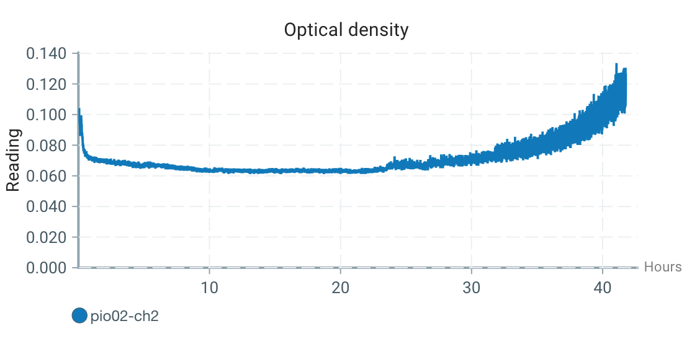

## Affordable, infinitely scaleable bioreactors

The basic concept of Pioflo is that we turn the tried-and-tested pioreactor into a flow through cell.  This means that any size of <abbr title="completely stirred tank reactor">CSTR</abbr> can be converted to a bioreactor by adding a Pioflo to control the <abbr title="completely stirred tank reactor">CSTR</abbr> by real-time measurement of optical density.

