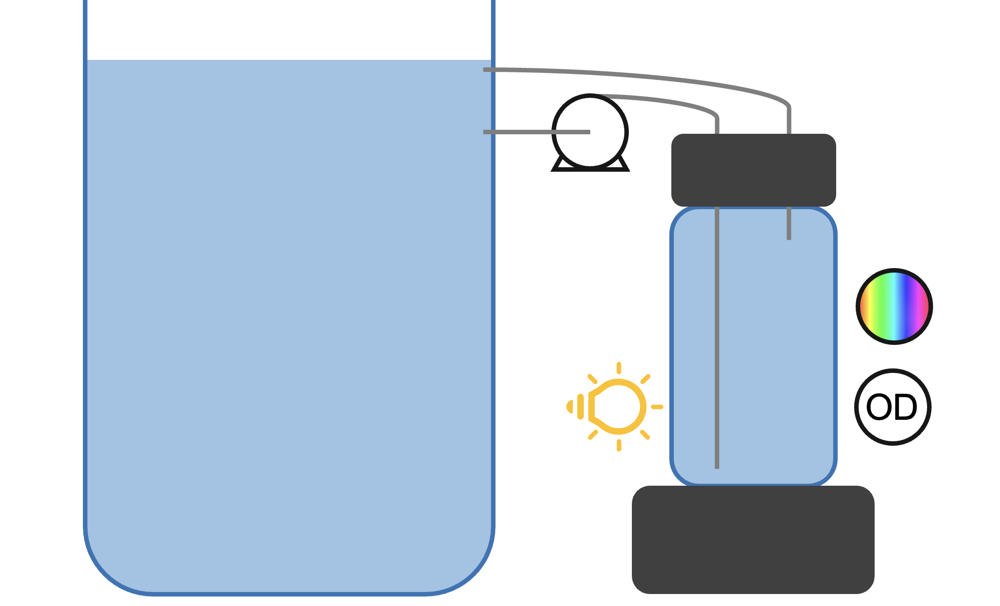

## Affordable, infinitely scaleable bioreactors

The basic concept of Pioflo is that we turn the tried-and-tested [Pioreactor](https://pioreactor.com/) into a flow through cell.  This means that any size of <abbr title="completely stirred tank reactor">CSTR</abbr> can be converted to a bioreactor by adding a Pioflo to control the <abbr title="completely stirred tank reactor">CSTR</abbr> using real-time measurement of optical density.

Lets discuss next steps at [forum.amybo.org](https://forum.amybo.org/t/pioflo-org-enabling-affordable-bioreactors-at-scale/91) - and check out the write up to date below: